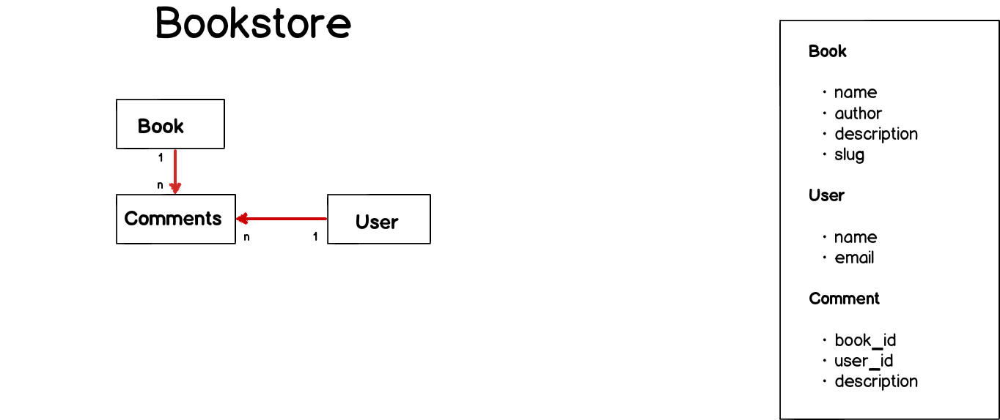

## Bookstore

## Steps

1. Fork [bookstore](https://github.com/hackerschoolmty/bookstore.git) repository
2. Run `bundle install` to install any dependency
3. Run `rake db:migrate` to create the schema
4. Run `rake db:seed` to create development data
5. Complete user stories described in [here](#user-stories)
6. Make a PR to bookstore repository master once you have finished.

## Model attributes 

## User stories

### For admin

* As an admin I have access to CRUD operations for other users
* As an admin I have access to CRUD operations for books
* As an admin I can create comments
* As an admin I can delete any comment (even If it doesn't belong to me)

### For User

* As a regular user I have **reading** access to books 
* As a regular users I have **reading** access to users 
* As a regular user I can associate comments to a particular book
* As a regular user I can only delete my own comments

### For guest

* As a guess user (not authenticated) I can *only* see book list and book detail.

