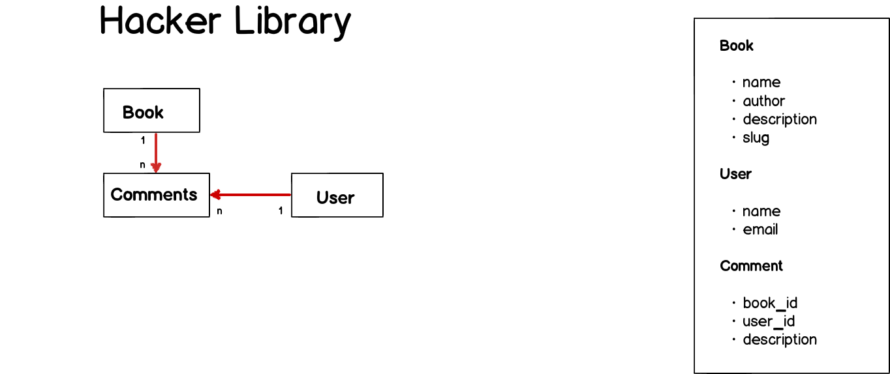

## Hacker library 

## Steps

1. Fork hacker_library repository we just made
2. Run `bundle install` to install any dependency
3. Run `rake db:migrate` to create the schema
4. Run `rake db:seed` to create development data
5. Complete user stories described in [here](#user-stories)
6. Make a PR to hacker_library repository master once you have finished.

## Model attributes 

## User stories

* As an admin user I have access to 
	- CRUD operations for other users
	- CRUD operations for books
* As a regular user I have **reading** access to 
	- Books and user
	- I can *only* edit my own information

* As a guess user (not authenticated) I can *only* see book list and book detail.

